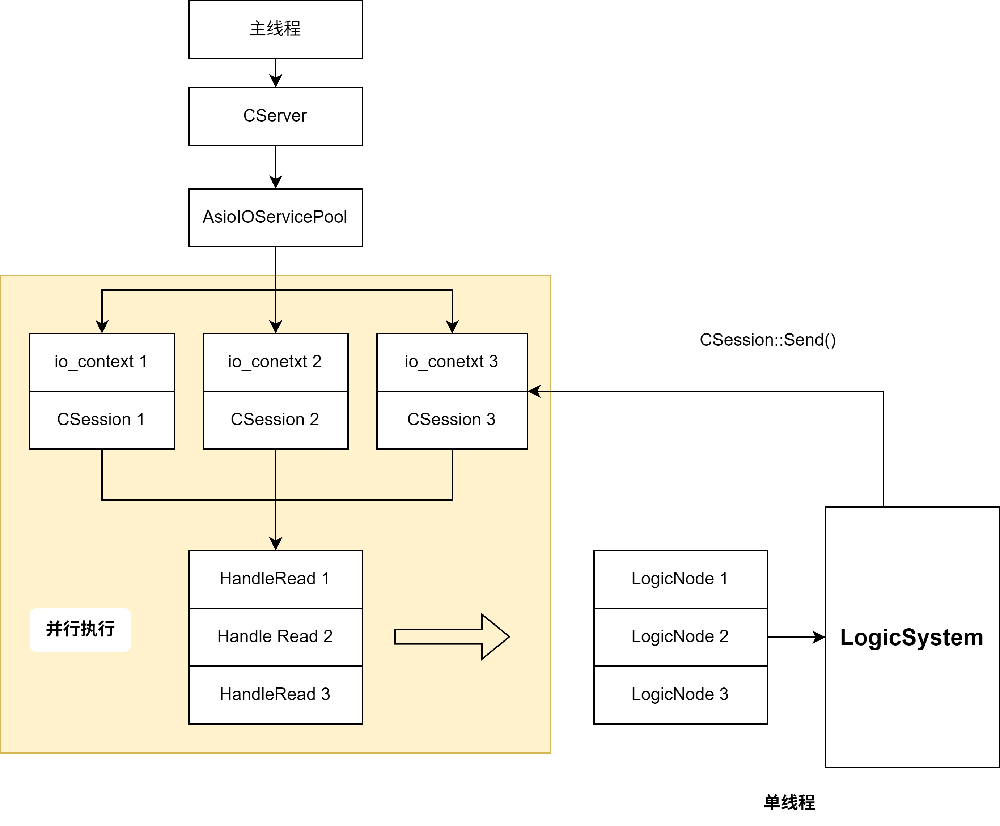
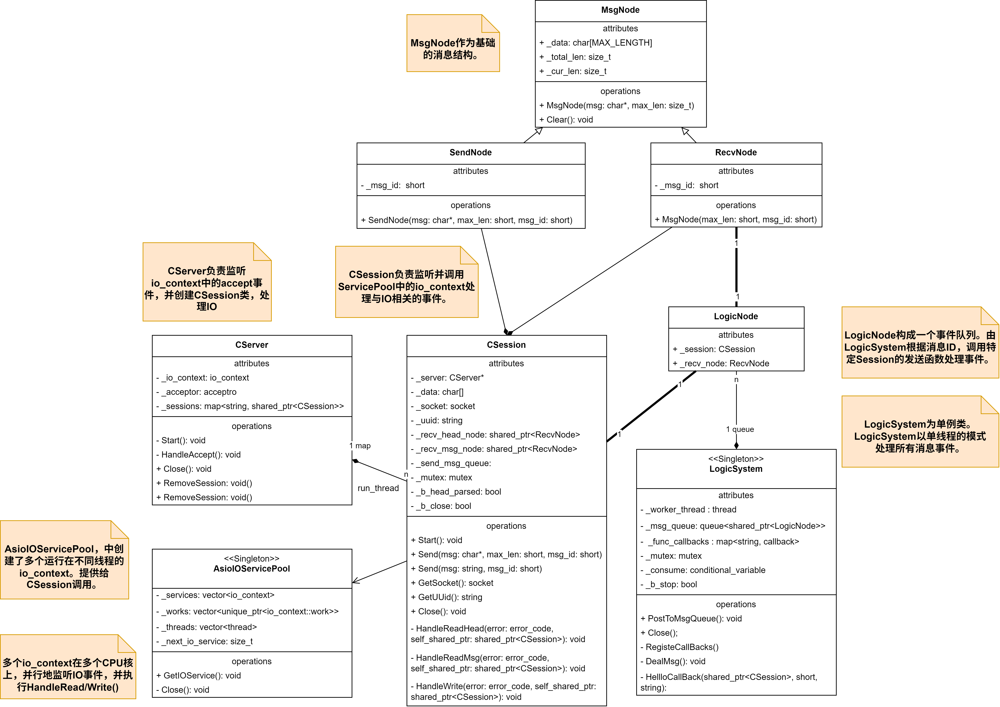

# AsyncServer模型流程梳理

## 模型



## UML图



## Client && CSession/CServer

```Mermaid
sequenceDiagram
    participant Client
    participant CServer
    participant CSession
    participant io_context
    

    CServer ->> CServer: 初始化acceptor, 开始监听CServer.start_accept()
    io_context ->> io_context:ioc.run()
    Client->>CServer: 发起连接请求
    CServer->>io_context: 注册async_accept()
    io_context-->>CServer: 连接到达，触发回调handle_accept()
    CServer->>CSession: 创建新会话,CSession.Start()
    CSession->>io_context: 注册async_read
    Client->>CSession: 发送数据
    io_context-->>CSession: 数据可读，触发回调handle_read()
    CSession->>CSession: 处理业务逻辑
    CSession->>io_context: 注册async_write
    CSession-->>Client: 发送响应数据
    io_context-->>CSession: 数据发送完成，触发回调handle_write()
    CSession->>io_context: 再次注册async_read

```

## CSession & LogicSystem

```Mermaid
sequenceDiagram
    participant CSession
    participant LogicSystem
    participant LogicNode_Queue

    CSession->>LogicSystem: 单例模式调用
    LogicSystem->>LogicSystem: 初始化,注册CallBack事件，启动工作线程循环处理队列数据。
    CSession->> LogicNode_Queue: 将消息数据添加到队列
    LogicNode_Queue->>LogicSystem: 调用事件对应的CallBack
    LogicSystem->>CSession: 执行CallBack，处理数据Send()
```


## AsioIOServicePool与AsioIOThreadPool的对比

二者地模型都是由主线程执行`CServer`，单线程地监听主线程`io_context`上的**连接请求**。构

### AsioIOServicePool(并发)

AsioIOServicePool中，创建了多个`io_context`，这些`io_context`运行在多个CPU核心上，**并发地**执行不同的`CSession`上的异步IO与异步`HandleIO()`函数。

`LogicSystem`负责单线程地从队列中读取数据，并执行对应的回调函数。随后调用`CSession`的`Send()`函数，并发地执行异步`Write()`。

因此：在监听连接事件和异步IO的过程，利用了`io_context`多线程的并发。在LogicSystem执行数据处理的过程为单线程执行。


### AsioIOThreadPool(并行)

AsioIOThreadPool与ServicePool的不同主要在于，它只存在一个`io_context`，这个`io_context`由多个`CSession`在多个线程**并行**地调用。

#### 隐患

由于`socket`的访问不是线程安全的。因此当多个线程以很小的时间间隔，执行同一个`socket`的`async_read()`时，就会导致重复读取`_data`数据，导致第2个线程的操作覆盖前一次的操作。

#### 解决方法：Strand序列化同一个CSession::socket上的操作

`boost::asio::strand`将单个`Session::socket`上的IO变为单线程的串行执行。而多个`Session`上的执行仍然是多线程并发执行的。避免了单一`socket`上的数据竞争问题。

1. 在`CSession`中添加成员变量，并且绑定`io_context`的执行器`get_executor()`。

```cpp
// 成员变量
using boost::asio::io_context;

boost::asio::strand<io_context::executor_type> _strand;

// 获取io_context的执行器，并绑定。
CSession::CSession(boost::asio::io_context& io_context, CServer* server):
    _socket(io_context), _server(server), _b_close(false),
    _b_head_parse(false), _strand(io_context.get_executor()){
    boost::uuids::uuid  a_uuid = boost::uuids::random_generator()();
    _uuid = boost::uuids::to_string(a_uuid);
    _recv_head_node = make_shared<MsgNode>(HEAD_TOTAL_LEN);
}
```

2. 在执行IO的过程中，使用`boost::asio::bind_executor()`函数，将IO的回调函数绑定到指定的`strand`上。

```cpp
_socket.async_read_some(
    boost::asio::buffer(_data, MAX_LENGTH),
    boost::asio::bind_executor(
        _strand, 
        std::bind(
            &CSession::HandleRead, this,
            std::placeholders::_1, std::placeholders::_2, SharedSelf()
        )
    )
);

boost::asio::async_write(
    _socket,
    boost::asio::buffer(msgnode->_data, msgnode->_total_len), 
    boost::asio::bind_executor(
        _strand,
        std::bind(
            &CSession::HandleWrite, this, std::placeholders::_1, SharedSelf()
        )
    )
);
```
