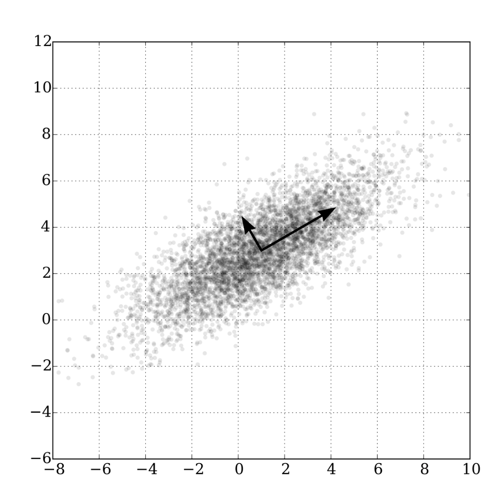

# PrincipleComponentAnalysis PCA 主成分分析

## 举例

假设一个二维空间中，所有的数据都均匀分布在x轴上，那么，数据在x上的方差显然是最大的。

因此如果需要把数据降维到1维，显然，使用x能够更好地保留数据之间地差异。反而使用y的话，所有数据集中在0附近，那么数据之间十分紧密，无法很好的进行区分。

进一步的，如果所有的数据都分布在一个$y=x$的直线附近。单独使用x或者y进行表示都差不多，但是如果将坐标轴逆时针旋转45°就可以得到和上一个例子中相似的场景。

此时，数据在新的x轴上的差异更大。这种差异我们使用协方差(convariance)表示。协方差越大说明数据的差异更明显，能够保留更多的信息。

**因此：如果要有效地降维，我们就需要找到一组能够使协方差最大的新的正交基向量。在这些正交基向量上投影，能够在降低数据维度的同时，保留数据的特征。**

> 这些新的正交基，就是主成分(Principle Components)

**并且：前 K 个主成分，就是前K个最大的特征值对应的特征向量。**

## 证明略

